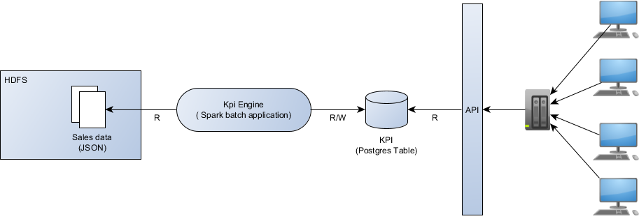

# Sales Report - Data Challenge

Solution proposal project for a data challenge proposed during an interview.

#### Built with
 * [Scala](https://www.scala-lang.org/) - General purpose programming language
 * [SBT](https://www.scala-sbt.org/) - Dependency management
 * [Spark](https://spark.apache.org/) - Open source distributed computing framework
 * [PostgreSQL](https://www.postgresql.org/) - Open source object-relational database 

## Problem and assumptions

### Original track
A manufacturer sells its items all around the world, geographically organised in 6 different regions divided
in 32 different areas, which in turn are made by 250 markets. Its central office periodically receives
information about sales and they would like to implement a dashboard that shows 4 charts at
any given time:
 - Top 5 markets by sales
 - Top 5 areas by sales
 - Sales by region in descending order
 - Sum of sales globally

### Extension and assumptions
 - Kpi (Key Performance Indicators on which dashboard are built) are relevant
 if referred to a timeframe, so they could be accessed by year, semester, quarter, month and day.
 - Sales update could arrive late
 - Input data is assumed to not have duplicates
 - Data is assumed to arrive on HDFS, partitioned by arrival day.


## Solution proposal
The solution overview is showed below:



The Kpi Engine is the application responsible to take the input data from HDFS
and compute the KPI.
In particular it is supposed to run periodically (each day), evaluating last day updates,
reading involved KPIs already stored, and computing their new values.

REST API are then exposed to retrieve the data for the dashboard.
KPI structure is made to be expose data that do not require almost any
further processing by the API.

### Kpi Engine
The KPI engine is a Spark batch application that take in input:
 - A technical configuration (with info on data retrieval)
 - Start and end partitions of new data to be evaluated

The engine read the new sale records in input from hdfs, the status of the KPI,
 calculate the new values of the KPI and write them back on PostgreSQL.

The KPI table has the following fields:
 - period_type: String
 - period_id: String
 - sales_sum: Long
 - sales_by_region: String (Actually a JSON)
 - sales_by_area: String (Actually a JSON)
 - sales_by_market: String (Actually a JSON)

### API
API could be exposed as described in 'doc/items-sales-api.yaml' file.

Import it in https://editor.swagger.io/ to navigate the API.

A real implementation __is not provided__ but it should only access PostgreSQL
to retrieve the data from postgreSQL and eventually filter the lists on
the "Top 5 markets/areas" KPIs.

## Usage Instructions
The application have been tested in a UNIX environment in local mode.
Usage in distributed environment (e.g. using a resource manager, pointing
to HDFS, etc.) could be done modifying the launch script and the configuration file.

### Build
An application JAR is needed to run the KPI engine.
Once located in the project root dir just run
``` sbt assembly ```
The application jar will be generated in *target\scala-2.11\ItemsSales-SparkProcessing-assembly-0.1.jar*

### Environment Setup
To simulate the usage of the application on a local environment an instance
of a PostgreSQL database is needed (while HDFS is replaced easily by the local filesystem).
The *kpi_sales* table must be created, use the _postgreSQL/ddl/create_kpi_table.sql_ script.

Info about the db location and the data location should be provided in a
configuration file (modify *src\main\resources\application.conf* at your convenience.
Data samples to test the application can be found in *data_sample* dir.

### Run
Run of the application on local environment could be done by the script
*bin/run_local.sh* providing the following parameters
 - *-c <location_of_the_configuration_file>*
 - *-s < first partition of input to be considered >*
 - *-e < last partition of input to be considered >*

Example:
```
sh bin/run_local.sh \
 -c src/main/resources/application.conf \
 -s 20181211 \
 -e 20181211
 ```
 
 ## Known issues
 There are some known issues, not addressed because out of scope in the challenge.
 - PostgreSQL password in clear text in config file
 - Missing integration tests
 - ... many others :) ...
 